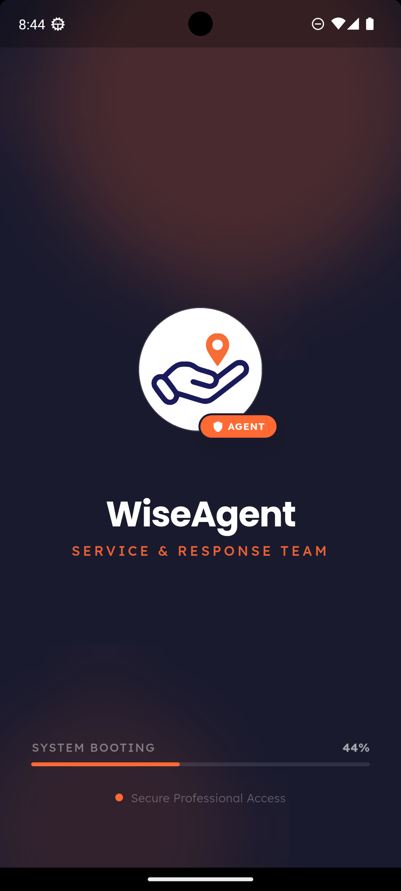
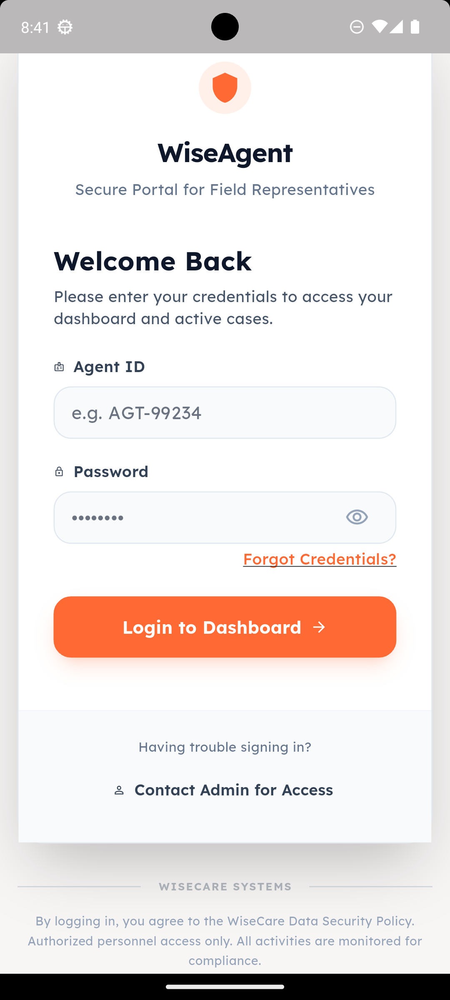
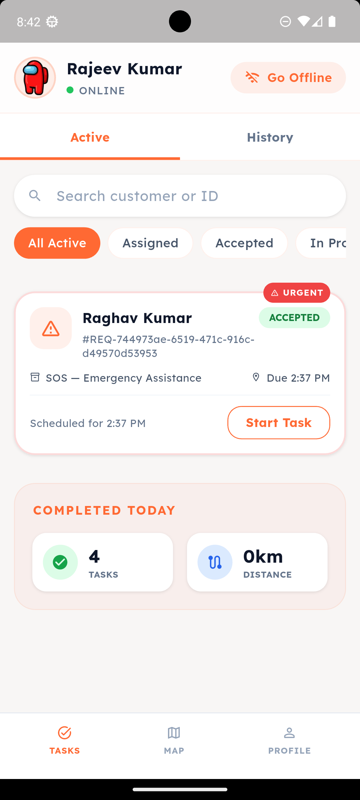
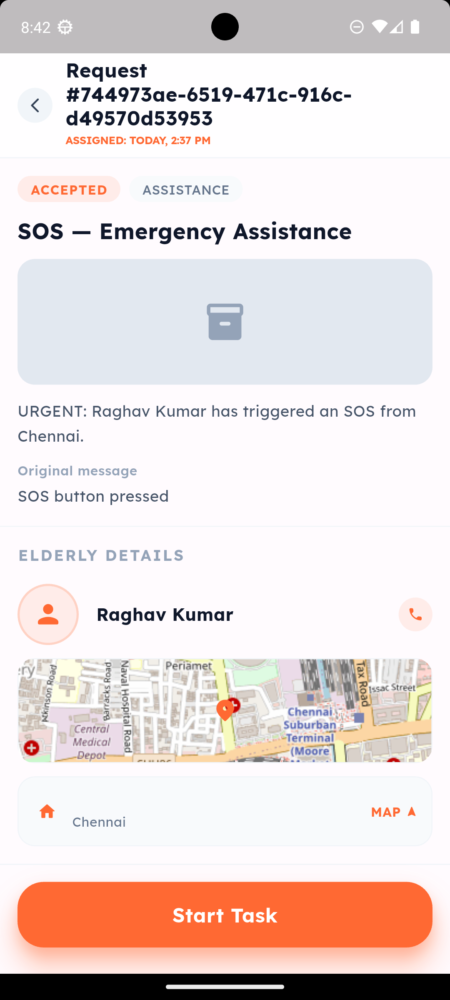
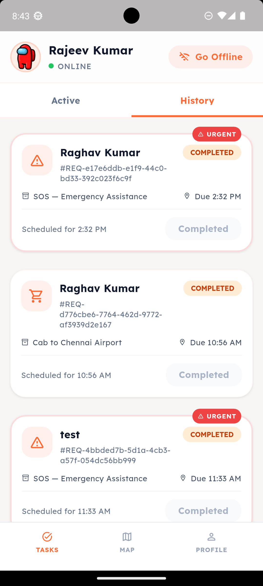
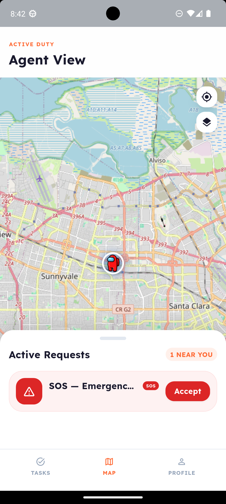
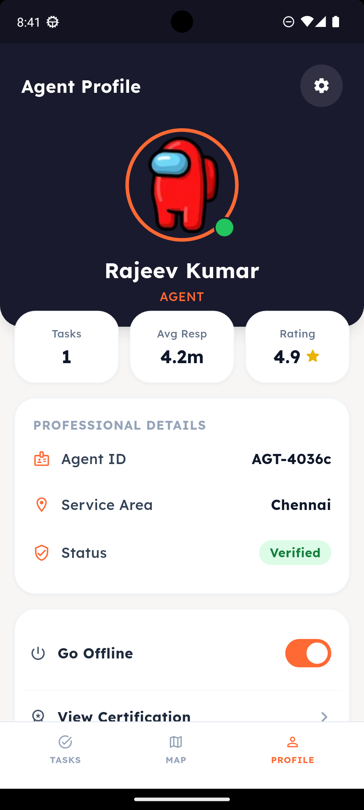
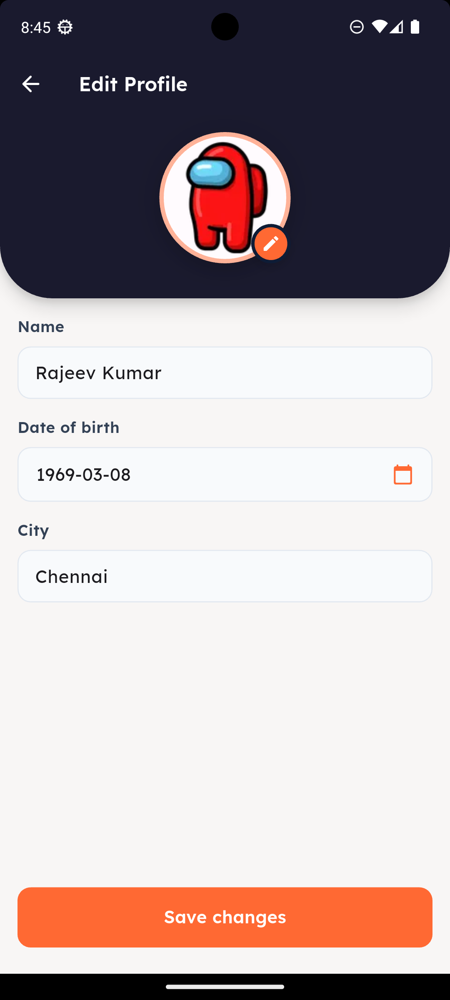

# WiseAgent Detailed Guide

If the README is the highlight reel, this is the full match replay.

## What WiseAgent Is

WiseAgent is the Flutter app used by care agents to execute service requests created by SOS flows and companion interactions.

It is built for speed, clarity, and accountability in field operations.

## Agent Workflow

1. Sign in
2. Load assigned requests
3. Open task detail and confirm context
4. Update lifecycle status
5. Finish task and move to next one

## Request Lifecycle

`ASSIGNED -> ACCEPTED -> IN_PROGRESS -> COMPLETED`  
`ASSIGNED -> REJECTED` (if agent cannot fulfill)

## API Methods Used in the App

Base URL: `https://3fl3pytece.execute-api.ap-south-1.amazonaws.com/prod`

### Auth

- `POST /auth/signin`
- `POST /auth/refresh`
- `POST /auth/signout`

### Tasks and Status

- `GET /service-requests`
- `GET /service-requests?status=COMPLETED&summary=today`
- `PATCH /service-requests/{requestId}/status`

### Profile

- `GET /users/me`
- `PUT /users/me`
- `GET /users/me/settings`
- `PUT /users/me/settings`
- `PUT /users/me/emergency-contact`
- `POST /uploads`

## API Notes from Integration Docs

- Task list can include enriched context like `distanceAway`, `mapImageUrl`, and `productImageUrl`.
- Status update supports optional `notes`; `distanceKm` is relevant when completing tasks.
- Profile load returns `user` payload; update accepts a subset of editable fields.

## App Structure

- `lib/ui/` screens and widgets
- `lib/provider/` state and orchestration
- `lib/services/` API integration layer
- `lib/network/` endpoint constants and Dio setup
- `docs/` feature integration notes and UI architecture checks

## Live Demo

- [WiseAgent](https://wisecareagent.vercel.app)

## Screens

<table>
  <tr>
    <td></td>
    <td></td>
    <td></td>
    <td></td>
  </tr>
  <tr>
    <td></td>
    <td></td>
    <td></td>
    <td></td>
  </tr>
</table>
